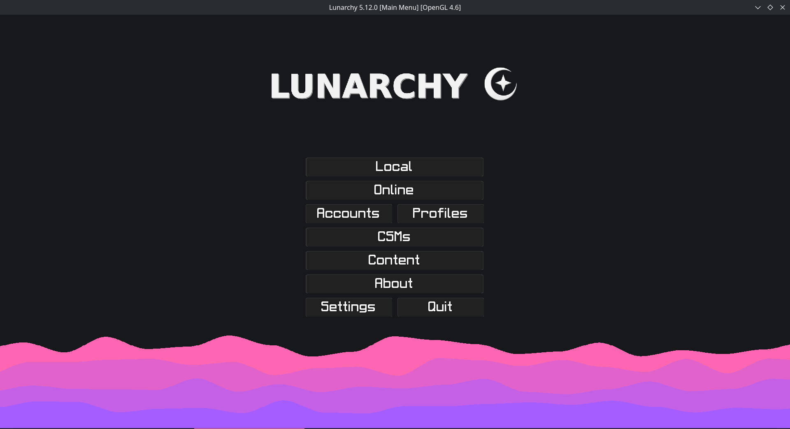
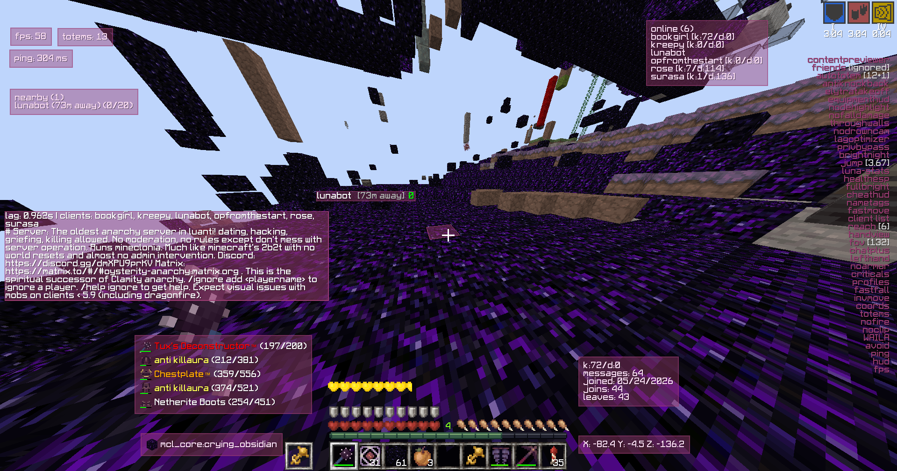

# Lunarchy v2 (fork of CloakV4) 

Difference from CloakV4:

- Instead of HUD themes, it's all controlled with HEX colour codes
- CheatHUD is moveable and syncs with 'HUD Color'
- Account Manager - saved accounts move to the top after they are used to log in
- Profiles - save and load module settings
- Global custom fonts - add a `.ttf`, `.otf`, or `.woff` to `fonts/`, then select
  it and its size from `Client` -> `HUD`; the selection is used by menus, HUDs, chat, formspecs,
  the console, and the cheat UI
- More modules geared for Mineclonia
    - ElytraTakeoff - hold your rockets and double press space
    - ContentPreviewer - shulkerbox, map, enderchest preview when hovering over them
    - CrystalSpam - auto crystal
    - AutoTotem - equips totems automatically
    - AutoArmor - puts on armor automatically
    - AutoWither - builds a wither automatically
        - can also apply nametags too
    - NoArmor - hides player's armor
- Extra Modules
    - ChatPlus - customize the chat position, colour, background and border
    - FPS - shows FPS in the HUD
    - Totems - shows your totem count in the HUD
    - waila - shows what block you are looking at
    - Friends - saves friends per server and makes Killaura ignore them
    - LogoutSpots - always records nearby player logout positions; the module
      toggle and its `Display` option control whether waypoints are visible.
      Use `.logoutspots` to list them or `.logoutspots clear` to clear them
    - DeathMarker - always records recent death positions; the module toggle
      and its `Display` option control whether the latest waypoint is visible.
      Use `.deathspots` to list them or `.deathspots clear` to clear them
    - Avoid - teleports 10-15 blocks away when another player enters the
      configured range, preferring a clear destination with safe ground
    - Ignore - hides messages from saved players and supports a priority
      whitelist, whitelist-only mode, Mineclonia `<player>` chat, and `/msg`
      replies; lists can also be managed with `.ignore`
    - bhop - bunny hop movement
    - FastFall - fall faster
    - Visuals - contains HandView (with full -100 to 100 positioning), NoFire,
      NoHurtCam, NoDrownCam, NoArmor, No Clouds, No Fog, Clearer Water, and
      No Particles
    - EquipmentHUD - shows equipment durability
    - Client List - shows clients connected to the server and nearby clients
    - Ping - shows your ping to the server
    - Lag Optimizer - individually disables expensive ground items,
      inventory/hand/plant/water/lava animations, post effects, minimap,
      bossbar, achievements, and animated node tiles
    - InvMove - lets you keep moving when in formspecs
    - Greeter - lets you send welcome or leave messages when clients join
    - Spammer+ - lets you spam from a txt file
- Modules Changed
    - MaceAura - a separate Combat toggle that keeps Killaura's menu focused
        - Mineclonia mace detection by item group or item name
        - Configurable mace target radius and drop height
        - Moves above the selected target for a mace drop, follows the target
          during the drop, and equips the best available torso armor
        - Optional jump/knockback suppression around a mace hit
        - Temporary wall-target noclip uses `PrivBypass` and is cleared when the
          drop ends; it does not enable ordinary noclip permanently
    - Nametags
        - added equipment and blocks away
    - ChatEffects
        - ChatColor can have gradients too
        - Derp, redacted, Reversed and random gradient options
    - Reach
    - Jetpack
    - Flight

# Compiling
- [Compiling on GNU/Linux](doc/compiling/linux.md)
- [Compiling on Windows](doc/compiling/windows.md)
- [Compiling on MacOS](doc/compiling/macos.md)
- [Compiling on Android](doc/android.md)

